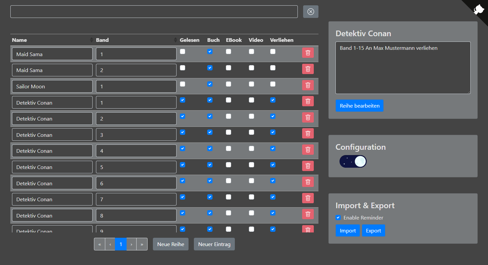

# MangMa
A small tool to track your mangas and other books. This project is hosted on Github Pages and operates on the localStorage.

 

## Libraries
 * Github Corners [github.com/YunYouJun/wc-github-corners](https://github.com/YunYouJun/wc-github-corners)
 * Vue.js [github.com/vuejs/vue](https://github.com/vuejs/vue)
 * Vuex [github.com/vuejs/vuex](https://github.com/vuejs/vuex)
 * BootstrapVue [github.com/bootstrap-vue/bootstrap-vue](https://github.com/bootstrap-vue/bootstrap-vue)
 * Bootstrap [github.com/twbs/bootstrap](https://github.com/twbs/bootstrap)
 * lodash [github.com/lodash/lodash](https://github.com/lodash/lodash)
 * dark-mode-toggle [github.com/H0rn0chse/dark-mode-toggle](https://github.com/H0rn0chse/dark-mode-toggle)